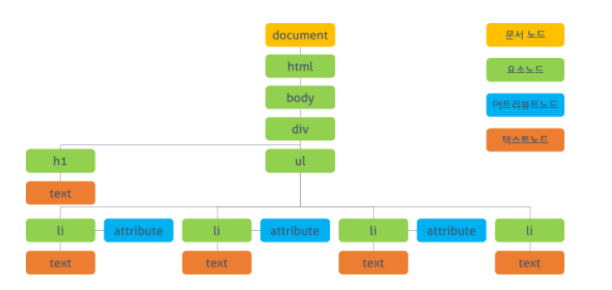
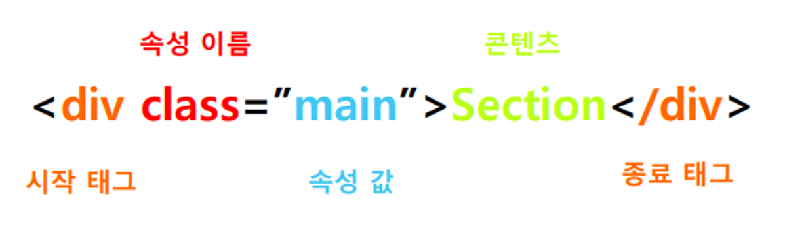

# DOM
## DOM이란?
- Document Object Model의 약자로 브라우저에 화면을 띄우기 위해 브라우저의 렌더링 엔진을  HTML문서 parsing을 거쳐 브라우저가 이해 할수 있는 자료 구조인 DOM를 생성함.



-  HTML문서의 계층적 구조와 정보를 표현하며 이를 제어할 수 있는 API를 제공하는 트리 형태의 자료구조.


##  Node (노드) 
- 트리를 구성하고 있는 기본 요소
- 노드에는 키 또는 값과 하위 노드에 대한 포인터를 가지고 있음.

## DOM의 주요 노드 종류

- DOM의 '진입점"이 되는 문서(document) 노드
- HTML 태그에서 만들어지며, DOM 트리를 구성하는 블록인 요소 노드(element node)
- 텍스트를 포함하는 텍스트 노드(text node)
- 화면에 보이지는 않지만, 정보를 기록하고 자바스크립트를 사용해 이 정보를 DOM으로부터 읽을 수 있는 주석(comment) 노드

### doucument Node
- 문서 노드는 DOM트리의 최상위에 존재하는 루트 노드로 document객체로 표현됨.
- 즉 document객체는 다른 노드들에게 접근하기 위한 진입점 역할을 담당

### Element Node + Attribute Node > text Node

- 각 HTML 요소를 가리키는 객체
- 이때 요소의 속성은 attribute Node 로 변환되어 요소 노드와 형제 관계를 형성하며,
텍스트 콘텐츠는 요소 노드의 자식 노드로 형성 됨.
- 중첩된 태그에 의해 부모 자식 관계를 형성함.

# 요소노드 취득
## doucument.getElementById("Id")
- document 노드 객체가 제공하는 getElementById 메서드는 인수로 전달한 id 속성값을 갖는 하나의 요소 노드를 탐색하여 반환
## doucument.querySelector("css선택자")
- 인수로 전달한 CSS선택자를 만족하는 요소 노드가 여러 개인 경우 첫 번째 노드만 반환함.
- 요소 노드가 존재하지 않으면 null을 반환함.
- ★ 주의 사항
```js
<li id="banana">바나나</li>
const $banana=document.getElementById('banana');
const $banana1=doucument.querySelector("#banana"); //-> querySelector는 css선택자를 값으로 가지므로 css선택자를 써줘야함.

```

## doucument.querySelectorAll("css선택자")
- 인수로 전달한 CSS선택자를 만족하는 요소 노드가 있는 경우, 제일 먼저 발견한 한 객체만 반환하는 querySelector와 달리
 querySelectorAll은  DOM 컬렉션 객체인 NodeList라는 유사 배열 객체를 반환함.
- 요소가 존재하지 않으면 빈 NodeList를 반환함.

## ★ 유사 배열 객체란?
- 말 그대로 배열같은 형태를 띄는 <span style="color:green"><b>객체</b></span>.
- 배열로 혼동할 수 있으므로 실제 배열로 바꿔서 쓰는 것을 권장함.
- 배열로 바꾸는법

    `const 변수 = [... 유사객체배열];`